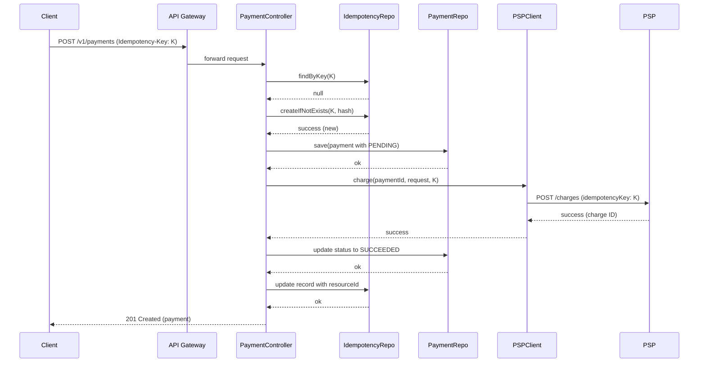

# Designing a Production-Ready Payment API: Deep Dive for Senior Engineers

**Module Type:** Self-Study / Advanced Training  
**Duration:** ~4 hours  
**Target Audience:** Senior Software Engineers (5–10+ years) with Java/Spring experience  
**Prerequisites:** Solid understanding of REST, HTTP, Spring Boot, and distributed systems basics.

---

## 1. What

**REST Resource Modeling for Payments** is the practice of designing a set of HTTP resources (URIs), representations (JSON/XML), and interaction semantics that accurately model the domain of financial transactions—specifically payments, refunds, and related operations. This includes:

- Identifying core resources: `Payment`, `Refund`, `PaymentMethod`, `Webhook`, etc.
- Defining standard CRUD and action endpoints (e.g., `POST /payments`, `GET /payments/{id}`, `POST /payments/{id}/capture`).
- Handling **pagination**, **filtering**, and **sorting** for collection endpoints.
- Designing **versioning** strategies (URI path, media type, etc.) to evolve the API without breaking existing clients.
- Creating **error models** that provide actionable information to developers.
- Specifying **idempotency** contracts to safely retry requests.
- Documenting the API using **OpenAPI** (formerly Swagger).

---

## 2. Why does it exist

**Problem Statement:**  
Payment APIs operate in a domain where **correctness**, **reliability**, and **consistency** are paramount. A poorly modeled payment resource can lead to:

- **Duplicate charges** due to lack of idempotency.
- **Data loss** or **inconsistent state** during network failures.
- **Client confusion** due to vague error messages or ambiguous semantics.
- **Breaking changes** that force mobile apps or partner integrations to fail.
- **Performance bottlenecks** caused by inefficient pagination or filtering.
- **Tight coupling** between internal services and external clients, making evolution painful.

The solution is a well-structured API that balances expressiveness, scalability, and evolvability while adhering to REST principles and industry best practices.

---

## 3. When to use it

Use this design approach when:

- Building a new payment service from scratch (e.g., in a fintech startup).
- Re-architecting an existing monolithic payment system into microservices.
- Exposing payment capabilities to **external partners** (e.g., marketplace sellers) or **mobile clients**.
- Introducing a new version of an API that must coexist with older ones.
- Dealing with high-throughput scenarios where pagination and filtering become critical.
- Integrating with third-party Payment Service Providers (PSPs) that require idempotent calls.

---

## 4. Where to use it

The design considerations apply across multiple architectural layers:

| Layer | Role |
|-------|------|
| **Edge / API Gateway** | Rate limiting, authentication, routing based on API version. |
| **API Layer (Controllers)** | Resource validation, request transformation, idempotency key handling. |
| **Service Layer** | Business logic, orchestration of PSP calls, event publishing. |
| **Domain Model** | Shared payment models (e.g., `Payment`, `Money`, `Currency`) – must be isolated from external representations. |
| **Data Access Layer** | Repository patterns for pagination and filtering queries. |
| **Integration Layer** | Retry mechanisms, backoff strategies, idempotent PSP client. |

---

## 5. How to implement (High-level steps)

1. **Domain Discovery** – Identify bounded contexts: Payments, Refunds, Payouts, etc.
2. **Resource Identification** – Define core resources and their relationships.
3. **Endpoint Design** – Map HTTP methods to operations; follow RESTful conventions.
4. **Pagination & Filtering Strategy** – Choose between offset and cursor pagination; define query parameters.
5. **Versioning Strategy** – Decide on URI versioning (`/v1/payments`) or content negotiation.
6. **Idempotency Design** – Specify idempotency keys for state-changing endpoints.
7. **Error Modeling** – Create a consistent error response structure.
8. **Contract Definition** – Write OpenAPI specification (contract-first) or generate from code (code-first) – **recommend contract-first** for APIs with external consumers.
9. **Multi-Module Build** – Organize Maven/Gradle modules to separate API contracts, domain models, and implementation.
10. **PSP Integration** – Implement retries with exponential backoff and idempotent calls.
11. **Testing & Validation** – Consumer-driven contract testing, performance testing, chaos engineering.

---

## 6. Architecture Diagram

```mermaid
graph TD
    subgraph Clients
        A[Mobile App]
        B[Partner Server]
    end

    subgraph Edge
        C[API Gateway]
    end

    subgraph Payment Service
        D[Payment Controller]
        E[Payment Service Logic]
        F[Payment Repository]
        G[PSP Client]
        H[Idempotency Store]
    end

    subgraph External
        I[PSP (e.g., Stripe)]
        J[Database]
    end

    A --> C
    B --> C
    C --> D
    D --> E
    E --> F
    E --> G
    E --> H
    F --> J
    G --> I
```

---

## 7. Scenario

**Real-World Use Case:**  
You are building a **payment platform** for an e-commerce marketplace. Sellers (partners) integrate via your API to accept payments from buyers. The platform must handle **10,000 transactions per second** during peak shopping seasons, support **mobile apps** (iOS/Android), and integrate with multiple PSPs (Stripe, Adyen). Existing partners rely on API version `v1`; a new version `v2` is needed to support additional features (e.g., multi-currency, subscription payments) without breaking existing integrations.

---

## 8. Goal

**Desired Outcomes & KPIs:**

- **Latency:** p99 < 200ms for payment creation (excluding PSP round-trip).
- **Throughput:** 10k TPS sustained.
- **Correctness:** Zero duplicate payments due to retries.
- **Availability:** 99.99% uptime for API endpoints.
- **Backward Compatibility:** 100% of v1 clients continue working after v2 deployment.
- **Developer Experience:** Clear OpenAPI docs with examples; error messages that reduce support tickets.
- **Maintainability:** Independent deployability of API versions and domain modules.

---

## 9. What Can Go Wrong (Failure Modes & Edge Cases)

- **Duplicate Payment:** A client retries a `POST /payments` due to network timeout, and the system processes it twice.
- **Inconsistent Pagination:** Using offset pagination, a new payment inserted before the current page causes items to shift, leading to duplicates or missing entries.
- **Breaking API Change:** Renaming a field in a response without versioning, causing mobile apps to crash.
- **Database Deadlocks:** Concurrent idempotency checks on the same key lead to race conditions.
- **PSP Timeout:** The PSP takes too long to respond; the client times out but the PSP eventually succeeds, leaving the payment in an inconsistent state.
- **Cyclic Dependencies:** Modules like `payment-api` and `refund-api` depend on each other, making builds brittle.
- **Inefficient Filtering:** Allowing unindexed filtering on large datasets leads to full table scans and high database load.
- **Memory Leaks:** Storing idempotency keys indefinitely without expiration.

---

## 10. Why It Fails (Root Cause Analysis)

| Failure | Root Cause |
|---------|------------|
| Duplicate payment | Lack of idempotency key handling or incorrect implementation (e.g., checking after processing). |
| Pagination artifacts | Using offset-based pagination on a frequently updated dataset without stable ordering. |
| Breaking change | No versioning strategy; developers assume internal changes don't affect clients. |
| Race conditions | Idempotency store with read-modify-write pattern without proper locking or atomic operations. |
| Inconsistent state after PSP timeout | No state reconciliation or idempotent retries on the PSP side; missing compensating transactions. |
| Cyclic dependencies | Violating layering rules; sharing domain models across modules that should be separated. |
| Slow queries | Filtering on non-indexed columns; lack of database query analysis. |
| Idempotency key storage bloat | No TTL or cleanup policy; using relational table without partitioning. |

---

## 11. Correct Approach (Architectural Patterns)

- **Idempotency Keys:** Require clients to send a unique key for each state-changing request. Store the key and the result (or processing state) atomically.
- **Cursor Pagination:** Use opaque cursors (e.g., encoded `(created_at, id)` tuples) instead of `offset` for stable, efficient pagination over large datasets.
- **API Versioning:** Adopt **URI path versioning** (`/v1/payments`) as it's simple and cache-friendly. Alternatively, use **custom media types** (`application/vnd.mycompany.v2+json`) for finer granularity.
- **Contract-First Design:** Define OpenAPI YAML first, then generate server stubs and client SDKs. This ensures the API contract is the source of truth.
- **Multi-Module with Dependency Inversion:** Use Maven/Gradle modules to separate API interfaces, domain models, and implementation. Ensure higher layers depend on abstractions, not concrete implementations.
- **Retry with Exponential Backoff:** For PSP calls, implement retries with jitter and exponential backoff, but only for idempotent operations.
- **Duplicate Suppression:** Use a database unique constraint on `(idempotency_key, resource_type)` to prevent duplicates.
- **Layered Error Handling:** Define error models with codes, messages, and details. Map internal exceptions to appropriate HTTP status codes (e.g., 409 for idempotency conflict, 422 for validation).

---

## 12. Key Principles

- **Idempotency:** The effect of multiple identical requests is the same as a single request. Essential for payment APIs.
- **CAP Theorem:** In distributed systems, you must choose between Consistency, Availability, and Partition Tolerance. Payment systems typically favor **Consistency** (e.g., using database transactions or idempotency) over Availability during network partitions.
- **Backward Compatibility:** An API change is backward-compatible if existing clients continue to work unchanged. Rules: don't rename/remove fields, don't change semantics, don't tighten constraints.
- **Postel’s Law:** "Be conservative in what you send, be liberal in what you accept." For APIs, this means accepting flexible input (within reason) and producing predictable output.
- **Single Responsibility Principle (SRP):** Each module/class should have one reason to change. Separate API contracts from business logic.
- **Explicit is better than implicit:** Idempotency keys must be explicit; do not rely on heuristics like timeouts.

---

## 13. Correct Implementation (Code)

We'll use Java 17, Spring Boot 3, Maven multi-module, and Spring Data JPA.

### 13.1 Multi-Module Maven Structure

```
payment-platform/
├── payment-api            (OpenAPI contract, generated DTOs)
├── payment-domain         (Domain models, interfaces)
├── payment-psp-client     (PSP integration, retry logic)
├── payment-service        (Business logic, controllers)
└── payment-app            (Spring Boot application)
```

**Root `pom.xml`** (simplified):

```xml
<modules>
    <module>payment-api</module>
    <module>payment-domain</module>
    <module>payment-psp-client</module>
    <module>payment-service</module>
    <module>payment-app</module>
</modules>
```

### 13.2 OpenAPI Contract (`payment-api/src/main/resources/openapi.yaml`)

```yaml
openapi: 3.0.1
info:
  title: Payment API
  version: 1.0.0
servers:
  - url: https://api.payments.com/v1
paths:
  /payments:
    post:
      summary: Create a payment
      operationId: createPayment
      parameters:
        - name: Idempotency-Key
          in: header
          required: true
          schema:
            type: string
            format: uuid
          description: Unique key for idempotent processing.
      requestBody:
        required: true
        content:
          application/json:
            schema:
              $ref: '#/components/schemas/CreatePaymentRequest'
      responses:
        '201':
          description: Payment created
          headers:
            Location:
              schema:
                type: string
              description: URI of the created payment.
          content:
            application/json:
              schema:
                $ref: '#/components/schemas/Payment'
        '409':
          description: Idempotency key already used with different request
          content:
            application/json:
              schema:
                $ref: '#/components/schemas/Error'
        '422':
          description: Validation error
          content:
            application/json:
              schema:
                $ref: '#/components/schemas/Error'
    get:
      summary: List payments
      parameters:
        - name: limit
          in: query
          schema:
            type: integer
            minimum: 1
            maximum: 100
            default: 20
        - name: cursor
          in: query
          schema:
            type: string
          description: Opaque cursor for pagination (from previous response).
        - name: status
          in: query
          schema:
            type: string
            enum: [pending, succeeded, failed]
      responses:
        '200':
          description: Paginated list of payments
          content:
            application/json:
              schema:
                $ref: '#/components/schemas/PaymentList'
components:
  schemas:
    Money:
      type: object
      properties:
        amount:
          type: integer
          minimum: 1
        currency:
          type: string
          pattern: '^[A-Z]{3}$'
    CreatePaymentRequest:
      type: object
      required: [amount, currency, paymentMethod]
      properties:
        amount:
          type: integer
          example: 1000
        currency:
          type: string
          example: USD
        paymentMethod:
          type: string
          description: Tokenized payment method ID.
        metadata:
          type: object
          additionalProperties: true
    Payment:
      type: object
      properties:
        id:
          type: string
          format: uuid
        amount:
          $ref: '#/components/schemas/Money'
        status:
          type: string
          enum: [pending, succeeded, failed]
        createdAt:
          type: string
          format: date-time
    PaymentList:
      type: object
      properties:
        data:
          type: array
          items:
            $ref: '#/components/schemas/Payment'
        nextCursor:
          type: string
          nullable: true
    Error:
      type: object
      properties:
        code:
          type: string
          example: "IDEMPOTENCY_CONFLICT"
        message:
          type: string
        details:
          type: object
```

### 13.3 Generated DTOs (using OpenAPI Generator Maven plugin)

Configure in `payment-api/pom.xml`:

```xml
<plugin>
    <groupId>org.openapitools</groupId>
    <artifactId>openapi-generator-maven-plugin</artifactId>
    <version>6.6.0</version>
    <executions>
        <execution>
            <goals>
                <goal>generate</goal>
            </goals>
            <configuration>
                <inputSpec>${project.basedir}/src/main/resources/openapi.yaml</inputSpec>
                <generatorName>spring</generatorName>
                <library>spring-boot</library>
                <apiPackage>com.payments.api</apiPackage>
                <modelPackage>com.payments.model</modelPackage>
                <generateApiTests>false</generateApiTests>
                <generateModelTests>false</generateModelTests>
                <configOptions>
                    <useSpringBoot3>true</useSpringBoot3>
                    <useJakartaEe>true</useJakartaEe>
                    <interfaceOnly>true</interfaceOnly>
                    <skipDefaultInterface>true</skipDefaultInterface>
                </configOptions>
            </configuration>
        </execution>
    </executions>
</plugin>
```

This generates interfaces like `PaymentsApi` with methods `createPayment` and `listPayments`.

### 13.4 Domain Module (`payment-domain`)

Contains domain entities and repository interfaces. No Spring dependencies, plain Java.

```java
package com.payments.domain;

import java.time.Instant;
import java.util.UUID;

public class Payment {
    private UUID id;
    private Money amount;
    private PaymentStatus status;
    private Instant createdAt;
    // getters/setters, constructors
}
```

### 13.5 Idempotency Handling in Service

**Idempotency Store Entity** (in `payment-domain`):

```java
package com.payments.domain;

import java.time.Instant;
import java.util.UUID;

public class IdempotencyRecord {
    private UUID id;
    private String idempotencyKey;
    private String resourceType; // e.g., "payment"
    private String resourceId;    // ID of created resource
    private String requestHash;   // hash of request body to detect mismatches
    private Instant createdAt;
    // getters/setters
}
```

**IdempotencyRepository** interface (in `payment-domain`):

```java
package com.payments.domain;

import java.util.Optional;

public interface IdempotencyRepository {
    Optional<IdempotencyRecord> findByKey(String key);
    void save(IdempotencyRecord record);
    // atomic create-if-not-exists
    boolean createIfNotExists(IdempotencyRecord record);
}
```

**Payment Service Implementation** (in `payment-service`):

```java
package com.payments.service;

import com.payments.domain.*;
import com.payments.model.CreatePaymentRequest;
import com.payments.model.Payment; // generated DTO
import com.payments.psp.PspClient;
import lombok.RequiredArgsConstructor;
import lombok.extern.slf4j.Slf4j;
import org.springframework.stereotype.Service;
import org.springframework.transaction.annotation.Transactional;

import java.nio.charset.StandardCharsets;
import java.security.MessageDigest;
import java.security.NoSuchAlgorithmException;
import java.time.Instant;
import java.util.HexFormat;
import java.util.UUID;

@Service
@RequiredArgsConstructor
@Slf4j
public class PaymentService {

    private final IdempotencyRepository idempotencyRepo;
    private final PaymentRepository paymentRepo;
    private final PspClient pspClient;

    @Transactional
    public Payment createPayment(String idempotencyKey, CreatePaymentRequest request) {
        // 1. Check idempotency
        var existing = idempotencyRepo.findByKey(idempotencyKey);
        if (existing.isPresent()) {
            var record = existing.get();
            // Verify request hash matches
            String currentHash = hashRequest(request);
            if (!currentHash.equals(record.getRequestHash())) {
                throw new IdempotencyConflictException("Idempotency key already used with different request");
            }
            // Return existing resource
            return fetchPayment(record.getResourceId());
        }

        // 2. Atomically create idempotency record
        var record = new IdempotencyRecord();
        record.setIdempotencyKey(idempotencyKey);
        record.setRequestHash(hashRequest(request));
        record.setResourceType("payment");
        record.setCreatedAt(Instant.now());

        boolean created = idempotencyRepo.createIfNotExists(record);
        if (!created) {
            // Race condition: another thread just inserted
            // Re-fetch and verify
            var retryRecord = idempotencyRepo.findByKey(idempotencyKey)
                    .orElseThrow(() -> new IllegalStateException("Idempotency record missing after race"));
            if (!retryRecord.getRequestHash().equals(hashRequest(request))) {
                throw new IdempotencyConflictException("Idempotency key already used with different request");
            }
            return fetchPayment(retryRecord.getResourceId());
        }

        // 3. Process payment (call PSP, etc.)
        try {
            // Convert request to domain
            var payment = new Payment();
            payment.setId(UUID.randomUUID());
            payment.setAmount(new Money(request.getAmount(), request.getCurrency()));
            payment.setStatus(PaymentStatus.PENDING);
            payment.setCreatedAt(Instant.now());

            // Save locally first (status PENDING)
            paymentRepo.save(payment);

            // Call PSP with idempotency key (PSP might support its own idempotency)
            var pspResponse = pspClient.charge(payment.getId(), request, idempotencyKey);

            // Update payment status based on PSP response
            payment.setStatus(mapPspStatus(pspResponse));
            paymentRepo.save(payment);

            // Update idempotency record with resource ID
            record.setResourceId(payment.getId().toString());
            idempotencyRepo.save(record); // update

            return toDto(payment);
        } catch (Exception e) {
            // On failure, we need to decide: if PSP call failed but we have a local record,
            // we might need to retry later. For now, we could mark as failed and update idempotency.
            // But careful: idempotency record already exists, so subsequent requests with same key will return failure.
            // Better to have a status in idempotency record to indicate processing state.
            // For simplicity, we'll catch and rethrow, but we should update idempotency with failure.
            log.error("Payment processing failed for key {}", idempotencyKey, e);
            // Update record to indicate failure? Possibly store error details.
            // We'll skip for brevity.
            throw e;
        }
    }

    private String hashRequest(CreatePaymentRequest request) {
        try {
            MessageDigest digest = MessageDigest.getInstance("SHA-256");
            byte[] hash = digest.digest(request.toString().getBytes(StandardCharsets.UTF_8));
            return HexFormat.of().formatHex(hash);
        } catch (NoSuchAlgorithmException e) {
            throw new RuntimeException(e);
        }
    }
    // ... other methods
}
```

**Important:** The `createIfNotExists` method must be implemented atomically. With JPA, you can use `@Lock(LockModeType.PESSIMISTIC_WRITE)` or a database unique constraint and catch `DataIntegrityViolationException`. Example:

```java
@Repository
public interface JpaIdempotencyRepository extends JpaRepository<IdempotencyRecord, UUID> {
    Optional<IdempotencyRecord> findByIdempotencyKey(String key);

    @Modifying
    @Query(value = "INSERT INTO idempotency_records (id, idempotency_key, request_hash, resource_type, created_at) " +
            "VALUES (:#{#record.id}, :#{#record.idempotencyKey}, :#{#record.requestHash}, :#{#record.resourceType}, :#{#record.createdAt}) " +
            "ON CONFLICT (idempotency_key) DO NOTHING", nativeQuery = true)
    int insertIfNotExists(IdempotencyRecord record);
}
```

Then in service, call `insertIfNotExists` and check return value.

### 13.6 PSP Client with Retry and Exponential Backoff

```java
package com.payments.psp;

import lombok.extern.slf4j.Slf4j;
import org.springframework.beans.factory.annotation.Value;
import org.springframework.stereotype.Component;
import org.springframework.web.client.RestTemplate;

import java.time.Duration;
import java.util.UUID;
import java.util.concurrent.TimeUnit;

@Component
@Slf4j
public class PspClient {

    private final RestTemplate restTemplate;
    private final int maxRetries;
    private final Duration initialBackoff;

    public PspClient(RestTemplate restTemplate,
                     @Value("${psp.max-retries:3}") int maxRetries,
                     @Value("${psp.initial-backoff-ms:100}") long initialBackoffMs) {
        this.restTemplate = restTemplate;
        this.maxRetries = maxRetries;
        this.initialBackoff = Duration.ofMillis(initialBackoffMs);
    }

    public PspResponse charge(UUID paymentId, CreatePaymentRequest request, String idempotencyKey) {
        // Build PSP request
        var pspRequest = new PspChargeRequest(paymentId, request.getAmount(), request.getCurrency(), idempotencyKey);
        int attempt = 0;
        while (true) {
            try {
                // Call PSP endpoint
                var response = restTemplate.postForEntity("https://psp.example.com/charges", pspRequest, PspResponse.class);
                return response.getBody();
            } catch (Exception e) {
                attempt++;
                if (attempt >= maxRetries) {
                    log.error("PSP call failed after {} attempts for payment {}", attempt, paymentId, e);
                    throw new PspException("PSP unavailable", e);
                }
                // Exponential backoff with jitter
                long delay = initialBackoff.toMillis() * (long) Math.pow(2, attempt - 1);
                long jitter = (long) (delay * 0.2 * Math.random()); // up to 20% jitter
                delay += jitter;
                log.warn("PSP call failed, retrying in {} ms (attempt {})", delay, attempt);
                try {
                    TimeUnit.MILLISECONDS.sleep(delay);
                } catch (InterruptedException ie) {
                    Thread.currentThread().interrupt();
                    throw new PspException("Retry interrupted", ie);
                }
            }
        }
    }
}
```

### 13.7 Pagination Implementation with Cursor

In repository, use a query that sorts by a stable field (e.g., `created_at`, `id`). Example JPA:

```java
public interface PaymentRepository extends JpaRepository<Payment, UUID> {
    @Query("SELECT p FROM Payment p WHERE " +
           "(:cursorCreatedAt IS NULL OR (p.createdAt < :cursorCreatedAt OR (p.createdAt = :cursorCreatedAt AND p.id < :cursorId))) " +
           "ORDER BY p.createdAt DESC, p.id DESC")
    List<Payment> findAfterCursor(@Param("cursorCreatedAt") Instant cursorCreatedAt,
                                   @Param("cursorId") UUID cursorId,
                                   Pageable pageable);
}
```

Cursor encoding: encode `createdAt` and `id` into a base64 string.

```java
public class CursorUtil {
    public static String encodeCursor(Instant createdAt, UUID id) {
        String raw = createdAt.toString() + "|" + id.toString();
        return Base64.getUrlEncoder().encodeToString(raw.getBytes(StandardCharsets.UTF_8));
    }

    public static Cursor decodeCursor(String cursor) {
        String decoded = new String(Base64.getUrlDecoder().decode(cursor), StandardCharsets.UTF_8);
        String[] parts = decoded.split("\\|", 2);
        return new Cursor(Instant.parse(parts[0]), UUID.fromString(parts[1]));
    }
}
```

Controller:

```java
@GetMapping("/payments")
public ResponseEntity<PaymentList> listPayments(@RequestParam(defaultValue = "20") int limit,
                                                @RequestParam(required = false) String cursor,
                                                @RequestParam(required = false) PaymentStatus status) {
    Pageable pageable = PageRequest.of(0, limit + 1); // fetch one extra to know if there's next
    List<Payment> payments;
    String nextCursor = null;

    if (cursor == null) {
        // first page
        payments = paymentRepository.findFirstPage(status, pageable);
    } else {
        var cursorObj = CursorUtil.decodeCursor(cursor);
        payments = paymentRepository.findAfterCursor(cursorObj.createdAt(), cursorObj.id(), status, pageable);
    }

    // Determine if there are more
    if (payments.size() > limit) {
        Payment last = payments.get(limit - 1);
        nextCursor = CursorUtil.encodeCursor(last.getCreatedAt(), last.getId());
        payments = payments.subList(0, limit);
    }

    // Convert to DTOs
    List<PaymentDto> dtos = payments.stream().map(this::toDto).toList();
    return ResponseEntity.ok(new PaymentList().data(dtos).nextCursor(nextCursor));
}
```

### 13.8 Error Handling

Global exception handler:

```java
@RestControllerAdvice
public class GlobalExceptionHandler {

    @ExceptionHandler(IdempotencyConflictException.class)
    public ResponseEntity<Error> handleIdempotencyConflict(IdempotencyConflictException ex) {
        Error error = new Error()
                .code("IDEMPOTENCY_CONFLICT")
                .message(ex.getMessage());
        return ResponseEntity.status(HttpStatus.CONFLICT).body(error);
    }

    @ExceptionHandler(MethodArgumentNotValidException.class)
    public ResponseEntity<Error> handleValidation(MethodArgumentNotValidException ex) {
        Error error = new Error()
                .code("VALIDATION_FAILED")
                .message("Invalid input")
                .details(ex.getBindingResult().getAllErrors().stream()
                        .map(DefaultMessageSourceResolvable::getDefaultMessage)
                        .collect(Collectors.toList()));
        return ResponseEntity.status(HttpStatus.UNPROCESSABLE_ENTITY).body(error);
    }

    // ... other handlers
}
```

---

## 14. Execution Flow (Sequence Diagram)



---

## 15. Common Mistakes (Anti-Patterns)

1. **Using offset pagination for large datasets**  
   - *Wrong:* `SELECT * FROM payments LIMIT 20 OFFSET 10000` – becomes slower as offset grows, and results shift if new records inserted.
   - *Correct:* Use cursor pagination with a stable sort.

2. **Ignoring idempotency for PSP calls**  
   - *Wrong:* Retrying a PSP call without an idempotency key, causing duplicate charges.
   - *Correct:* Always send idempotency key to PSP if supported; otherwise, implement a local deduplication table.

3. **Breaking changes without versioning**  
   - *Wrong:* Renaming `amount` to `totalAmount` in v1 response.
   - *Correct:* Create a new endpoint `/v2/payments` and keep v1 unchanged.

4. **Cyclic dependencies between modules**  
   - *Wrong:* Module `payment-api` depends on `payment-domain`, and `payment-domain` depends on `payment-api` (e.g., using DTOs in domain).
   - *Correct:* Domain should have no external dependencies; API module depends on domain.

5. **Storing idempotency keys forever**  
   - *Wrong:* No TTL, causing table bloat.
   - *Correct:* Set a TTL (e.g., 24 hours) and archive/delete old records.

6. **Using fixed backoff without jitter**  
   - *Wrong:* Retry every 1 second – can cause thundering herd when service recovers.
   - *Correct:* Exponential backoff with random jitter.

7. **Exposing internal IDs to clients**  
   - *Wrong:* Using database auto-increment IDs in URIs, allowing enumeration attacks.
   - *Correct:* Use UUIDs or opaque tokens.

8. **Inconsistent error responses**  
   - *Wrong:* Returning plain text errors for some endpoints and JSON for others.
   - *Correct:* Standardize error format across all endpoints.

9. **Not documenting idempotency requirements**  
   - *Wrong:* Assuming clients know to retry safely.
   - *Correct:* Explicitly document idempotency keys in OpenAPI and error codes.

10. **Tight coupling with PSP models**  
    - *Wrong:* Using PSP-specific objects directly in service layer.
    - *Correct:* Map PSP responses to internal domain models to isolate changes.

---

## 16. Decision Matrix

| Decision | Option 1 | Option 2 | Winner (for payment API) | Rationale |
|----------|----------|----------|---------------------------|-----------|
| **Pagination** | Offset (`?offset=100&limit=20`) | Cursor (`?cursor=...`) | **Cursor** | Stable pagination, efficient for large datasets, avoids missing/duplicate items. |
| **Idempotency Key Storage** | In-memory cache (Redis) | Database with unique constraint | **Database** | Durability; payment data cannot be lost. Redis can be used for caching but DB as source of truth. |
| **Retry Backoff** | Fixed (e.g., 1s) | Exponential + jitter | **Exponential + jitter** | Reduces contention and thundering herd. |
| **API Versioning** | URI path (`/v1/payments`) | Media type (`Accept: application/vnd.v2+json`) | **URI path** | Simpler for clients, cache-friendly, widely adopted. Media type offers finer control but adds complexity. |
| **Contract-First vs Code-First** | Contract-first (OpenAPI YAML) | Code-first (annotations generate spec) | **Contract-first** | Ensures API design is intentional, works better with external consumers, and avoids implementation details leaking. |
| **Error Model** | Simple string message | Structured object with code, message, details | **Structured** | Enables automated handling and better debugging. |
| **PSP Call Failure Handling** | Fail fast and return error to client | Retry with idempotency | **Retry with idempotency** | Improves success rate on transient failures, but must be idempotent. |
| **Multi-Module Layout** | Single monolithic module | Multi-module with clear boundaries | **Multi-module** | Enforces separation of concerns, easier to test and deploy independently. |
| **Filtering Strategy** | Allow any field in query | Whitelist indexed fields | **Whitelist indexed fields** | Prevents accidental expensive queries; forces clients to use efficient filters. |

---

## Final Notes

This module provides a comprehensive blueprint for designing, implementing, and evolving a payment API. Senior engineers should internalize the trade-offs and patterns discussed, and apply them pragmatically based on specific business requirements. The code examples are production-ready but should be adapted to your infrastructure (database, PSP, etc.). Always test with consumer-driven contracts and load tests before going live.

**Next Steps:**  
- Set up a local environment with the multi-module structure.  
- Generate OpenAPI stubs and implement the service.  
- Add integration tests with testcontainers for PostgreSQL.  
- Implement a simple PSP mock to simulate failures and retries.  
- Run performance tests with different pagination strategies.

**Questions or clarifications?** [NEEDS INPUT: If you have specific raw content or scenarios, please provide them for deeper customization.]
